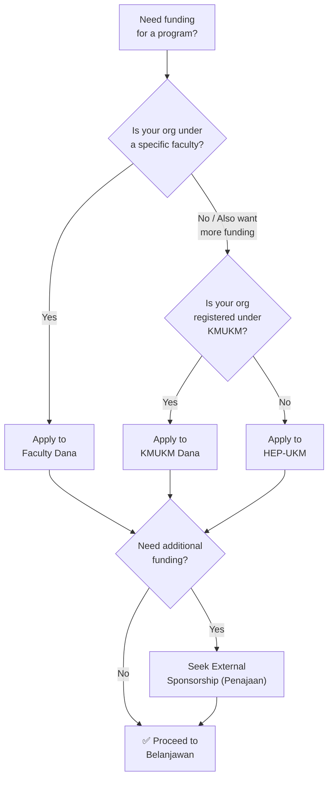

# 02 — Funding Sources (Sumber Dana)

This section covers every funding pathway available to UKM student organizations. Most programs use a combination of these sources.

---

## Decision Tree: Where Does Your Money Come From?

> **Note:** You can (and often should) apply to multiple sources simultaneously. A large program might get dana from Faculty + KMUKM + external sponsors.

---

## Funding Sources Overview

### Internal (Dalaman)

| Source | Best For | Subfolder |
|--------|----------|-----------|
| **HEP-UKM** | University-level programs, large-scale events | [`hep-ukm/`](hep-ukm/) |
| **Faculty** | Faculty-level programs, department events | [`fakulti/`](fakulti/) |
| **KMUKM** | Programs by KMUKM-registered organizations | [`kmukm/`](kmukm/) |

### External (Luaran)

| Source | Best For | Subfolder |
|--------|----------|-----------|
| **Sponsorship (Penajaan)** | Corporate sponsors, in-kind support, grants | [`penajaan/`](penajaan/) |
| **Ticket2u** | Participant fees via e-commerce platform | — |
| **Cash donations** | May qualify for tax exemption (Pengecualian Cukai) | [`penajaan/`](penajaan/) |
| **In-kind donations** | Goods/services/items (NOT eligible for tax exemption) | — |

---

## Subfolders

- **[`hep-ukm/`](hep-ukm/)** — HEP-UKM funding pathway (placeholder — doc to be added)
- **[`fakulti/`](fakulti/)** — Faculty-level funding with FTSM as a worked example
- **[`kmukm/`](kmukm/)** — KMUKM funding: Buku Panduan, Borang Aku Janji, pitching process
- **[`penajaan/`](penajaan/)** — External sponsorship: kit penajaan samples, surat templates, sponsor tracking sheets, tax exemption, Borang Derma
