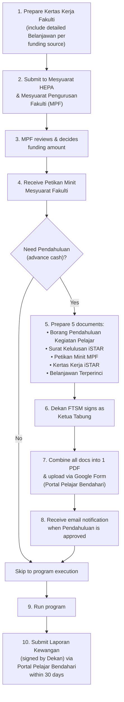

# Faculty-Level Funding (Dana Fakulti)

Each faculty has its own process for approving student program funding. This folder includes FTSM's procedure as a concrete example — check with your own faculty's HEP office for specifics.

---

## A-to-Z Flow: Faculty Funding (FTSM Example)

## FTSM-Specific Links

- **Google Form for Pendahuluan:** https://docs.google.com/forms/d/e/1FAIpQLSdWqPeRK1n9kBJ_nHgGAH2Ed59GFv3TOucTb14gUK7zQk3VmA/viewform
- **Portal Pelajar Bendahari:** https://bendahari.ukm.my/student_portal
- **Contact for Tuntutan:** Puan Zaidatul, Pejabat Prasiswazah FTSM (hardcopy submission, 30 days post-program)

## Files in This Folder

| File | Description |
|------|-------------|
| `prosedur-permohonan-dana-ftsm.pdf` | FTSM-specific funding & pendahuluan procedure |
| `borang-permohonan-dana.pdf` | Borang Permohonan Dana (2024/2025) |
