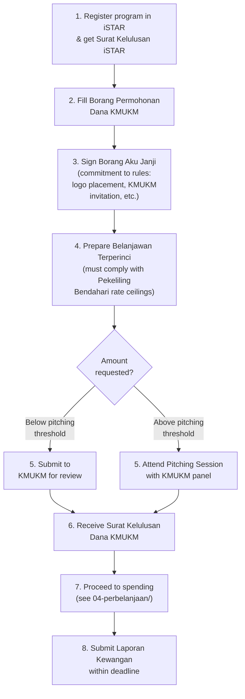

# KMUKM Funding (Dana KMUKM)

Kesatuan Mahasiswa UKM (KMUKM) provides funding for programs by registered student organizations. This is one of the most common funding sources for kelab/persatuan.

---

## A-to-Z Flow: KMUKM Funding Application

## Key Rules

- **Belanjawan compliance:** Your budget must follow rate ceilings from Pekeliling Bendahari Bil. 8/2022 (as amended by Bil. 4/2025). Non-compliant budgets will be rejected.
- **Borang Aku Janji obligations:** You commit to display the KMUKM logo on all program materials and invite the KMUKM President (or representative) to attend.
- **Pitching:** Larger amounts require an in-person pitching session. The threshold varies — check the Buku Panduan for current amounts.
- **Funding factors:** Amount approved depends on program type, scale, impact, student participation level, and budget appropriateness.
- **Penalty for violations:** If you violate the Borang Aku Janji terms (e.g., missing KMUKM logo, tarnishing KMUKM/UKM reputation), future funding applications will be impacted.

## Files in This Folder

| File | Description |
|------|-------------|
| `buku-panduan-dana-kmukm.pdf` | Complete A-Z guide for KMUKM funding (the "bible") |
| `borang-aku-janji.pdf` | Borang Aku Janji (commitment form) — must be signed before receiving dana |
