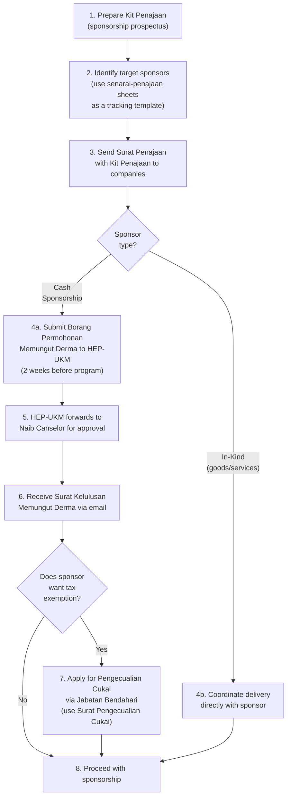

# External Sponsorship (Penajaan)

This section covers seeking sponsorship from companies, NGOs, and external parties — including cash sponsorship, in-kind sponsorship, and the Borang Derma process.

---

## A-to-Z Flow: Getting External Sponsorship

## Key Rules

- **Borang Derma is mandatory** for all programs receiving external cash funding. Submit to HEP-UKM or email to istar@ukm.edu.my.
- **Documents required for Borang Derma:** Borang Permohonan Memungut Derma + Surat Kelulusan iSTAR + Kertas Kerja iSTAR.
- **Do not modify the Borang Derma format** — it's an official UKM form.
- **Tax exemption (Pengecualian Cukai):** Only available for **cash sponsorship**. In-kind donations (assets, inventory, flight tickets, souvenirs) are NOT eligible.
- **Timeline:** Submit Borang Derma at least 2 weeks before program. Tax exemption approval is handled by Jabatan Bendahari and takes additional time.

## What Goes Into a Kit Penajaan

A good sponsorship kit typically includes:
1. Program overview and objectives
2. Target audience and expected reach
3. Sponsorship tiers (Platinum, Gold, Silver, Bronze, In-Kind)
4. Benefits per tier (logo placement, booth space, social media mentions, etc.)
5. Contact details of the sponsorship committee
6. Tax exemption information (for cash sponsors)

> See `kit-penajaan-contoh-1.pdf` and `kit-penajaan-piala-dekan.pdf` for real examples. `prospektus-tewo-contoh.pdf` is an English-language prospectus example.

## Files in This Folder

| File | Description |
|------|-------------|
| `kit-penajaan-contoh-1.pdf` | Sample sponsorship kit |
| `kit-penajaan-piala-dekan.pdf` | Piala Dekan FTSM sponsorship kit example |
| `prospektus-tewo-contoh.pdf` | TEWO English prospectus example |
| `surat-penajaan-template.docx` | Editable sponsorship letter template |
| `surat-pengecualian-cukai.pdf` | Tax exemption letter format |
| `borang-permohonan-derma.pdf` | Borang Permohonan Memungut Derma (official UKM form) |
| `senarai-penajaan-1.xlsx` | Sponsor tracking spreadsheet template |
| `senarai-penajaan-2.xlsx` | Sponsor tracking spreadsheet template (alternate) |
