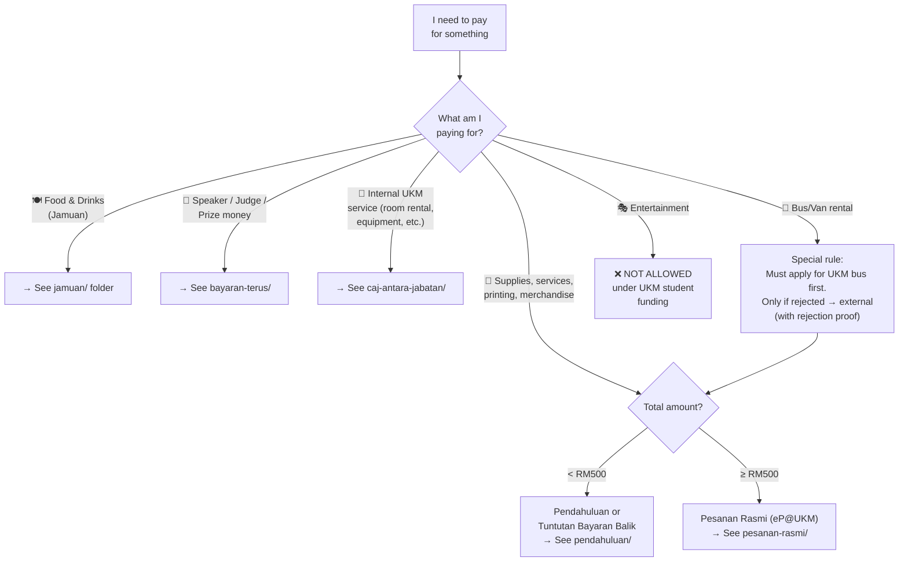

# 04 — Spending & Procurement (Perbelanjaan)

**This is the most important section in the repo.** It covers every method of spending program funds at UKM, with step-by-step procedures and the exact forms needed.

---

## Master Decision Tree: How Do I Pay For This?

---

## Spending Methods at a Glance

| Method | When to Use | Folder | Key Form |
|--------|-------------|--------|----------|
| **Pendahuluan** | Advance cash for items < RM500 | [`pendahuluan/`](pendahuluan/) | Borang Permohonan Pendahuluan Kegiatan Pelajar |
| **Tuntutan Bayaran Balik** | Reimbursement after paying out of pocket (< RM500) | [`pendahuluan/`](pendahuluan/) | Surat Permohonan Tuntutan Bayaran Balik |
| **Pesanan Rasmi** | Procurement ≥ RM500 via eP@UKM | [`pesanan-rasmi/`](pesanan-rasmi/) | Surat Permohonan Pesanan Rasmi |
| **Borang Pesanan Jamuan** | Food & drinks < RM500 (Borang Pink) | [`jamuan/`](jamuan/) | UKM-SPKPPP-PP04-BO02 |
| **Bayaran Terus** | Direct payment to speakers, judges, winners | [`bayaran-terus/`](bayaran-terus/) | Surat permohonan bayaran |
| **Caj Antara Jabatan (iFASt)** | Internal UKM services (room rental, printing, etc.) | [`caj-antara-jabatan/`](caj-antara-jabatan/) | Borang Caj Antara Jabatan |

---

## Items NOT Eligible for Pendahuluan

The following **cannot** be claimed via Pendahuluan or Tuntutan Bayaran Balik:

| Item | Reason | Correct Method |
|------|--------|----------------|
| Jamuan (in-campus) | Must use registered vendor | Borang Pesanan Jamuan or Pesanan Rasmi |
| Supplies/Services ≥ RM500 | Requires official procurement | Pesanan Rasmi (eP@UKM) |
| Speaker/Judge fees | Direct payment through UKM | Bayaran Terus |
| Inventory/Assets (printer, tent, table, etc.) | Capital items | Pesanan Rasmi |
| Internal UKM services | Inter-department billing | iFASt |
| Entertainment | Not permitted | ❌ |
| Course/participation fees | Direct to external institution | Bayaran Terus |

---

## Receipt Rules (Resit)

- **BEFORE program:** All receipts must be dated before or during the program period. Post-program receipts for pre-program items will be rejected.
- **Original receipts:** Hardcopy originals required. Keep photocopies for your own records.
- **No receipt, no claim:** Items without proper receipts (resit/invois) are rejected outright.
- **Items needing Pesanan Rasmi:** If you paid out of pocket for something that should have gone through Pesanan Rasmi (≥ RM500), the receipt will be **rejected entirely** — even if you have the receipt.
