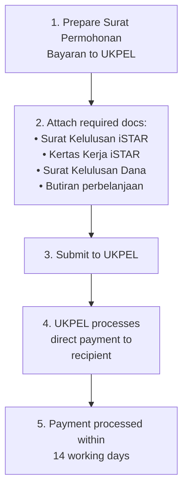

# Bayaran Terus (Direct Payment via UKM Account)

Bayaran Terus is for payments made directly from UKM's account to specific recipients — typically speakers, judges, facilitators, and prize winners.

---

## When to Use Bayaran Terus

- Payment to panel / penceramah (speakers / lecturers)
- Payment to pengadil (judges)
- Payment to pemenang (prize winners)
- Payment of yuran penyertaan (course/participation fees) to external organizers

> **Note:** UKM encourages using internal UKM staff as speakers. If using external speakers, ensure proper documentation.

## A-to-Z Flow

## For External Course/Participation Fees

If paying an external institution's participation fee:
1. Get the **invois** (invoice) from the institution
2. Attach the invois + surat jemputan (invitation letter) + standard documents above
3. Submit to UKPEL — payment goes directly to the institution

## Saguhati (Honorarium) Rates

Rates for speaker/facilitator honorarium follow **WP1.8** (Bayaran Saguhati Kepada Pensyarah/Penceramah Dan Fasilitator Sambilan). Check the current rates with UKPEL.
