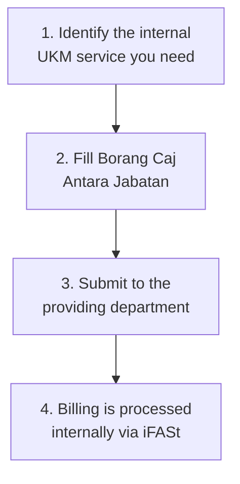

# Caj Antara Jabatan — iFASt (Inter-Department Billing)

iFASt is used when you consume services or supplies provided by another department **within UKM** — for example, renting a room, using campus equipment, or internal printing services.

---

## When to Use iFASt

- Room/venue rental from a UKM department
- Equipment rental from a UKM department
- Internal printing/reprographic services
- Any bekalan/perkhidmatan provided by another UKM unit

> **Key distinction:** iFASt is for **internal UKM-to-UKM** transactions only. If you're paying an external vendor, use Pendahuluan (< RM500) or Pesanan Rasmi (≥ RM500) instead.

## Flow

## Notes

- No cash changes hands — it's an internal accounting transfer.
- You do NOT need Pendahuluan or Pesanan Rasmi for iFASt items.
- Tuntutan Bayaran Balik is NOT applicable — you can't pay out-of-pocket for internal services.
