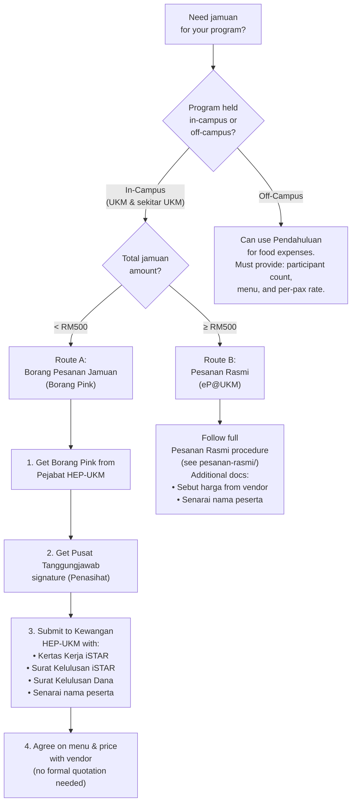

# Jamuan (Food & Beverages)

Jamuan is one of the most regulated expenses in UKM programs. The rules depend on **where** the program is held and **how much** the total jamuan costs.

---

## Decision Tree: Which Jamuan Route?

## Jamuan Eligibility Rules (Post Pindaan Bil. 4/2025)

| Program Duration | Crossing 12:30pm? | What You Can Provide |
|------------------|--------------------|----------------------|
| > 6 hours | — | Jamuan Ringan + Makan Tengah Hari |
| < 6 hours | Yes, crosses 12:30pm | Jamuan Ringan **or** Makan Tengah Hari |
| < 6 hours | No | Jamuan Ringan only |
| Any duration | Involves LPU Chair / VC / external guests | Jamuan Ringan + Makan Tengah Hari |

## In-Campus Vendor Requirement

For programs **within UKM and surrounding area**, you MUST use food vendors registered with UKM (pembekal berdaftar). You cannot simply buy from external restaurants and claim receipts.

## Rate Ceilings

Jamuan rates must comply with Pekeliling Bendahari Bil. 8/2022. The specific per-pax rates are set in the pekeliling — refer to [`01-garis-panduan/pindaan-bil-4-2025.pdf`](../../01-garis-panduan/pindaan-bil-4-2025.pdf) for the latest rates.

> **Tip:** When preparing your belanjawan, always check the current pekeliling rates first. Budget items exceeding the rate ceiling will be **rejected by Kewangan HEP-UKM** even if your overall budget is approved.

## Files in This Folder

| File | Description |
|------|-------------|
| `borang-pesanan-jamuan.pdf` | Borang Permohonan Pesanan Jamuan (UKM-SPKPPP-PP04-BO02) — effective 06 Jun 2025 |
