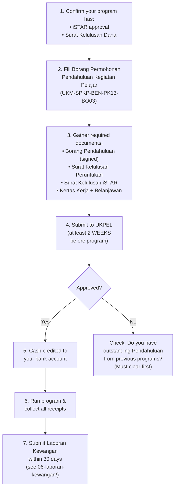

# Pendahuluan (Cash Advance) & Tuntutan Bayaran Balik (Reimbursement)

Pendahuluan is an advance cash disbursement credited to the applicant's bank account before the program. Tuntutan Bayaran Balik is a post-program reimbursement for items you paid out of pocket.

---

## A-to-Z Flow: Pendahuluan Application

## Eligibility Check

Before applying, confirm your expense is eligible:

| ✅ Eligible | ❌ Not Eligible |
|-------------|----------------|
| Supplies < RM500 | Jamuan (in-campus) |
| Transportation (if UKM bus rejected) | Supplies/Services ≥ RM500 |
| Raw materials (food ingredients, runcit) | Speaker/Judge fees |
| Homestay | Inventory/Assets |
| | Internal UKM services |
| | Entertainment |

## Important Notes

- **Previous Pendahuluan must be settled** before a new one can be approved. If you have unsubmitted Laporan Kewangan from a past program, clear that first.
- **Jamuan exception for off-campus programs:** If your program is held outside UKM, you CAN use Pendahuluan for food. You must provide participant count, menu, and per-pax rate for approval.
- The form is available at the Jabatan Bendahari website or UKPEL counter.

## Files in This Folder

| File | Description |
|------|-------------|
| `borang-pendahuluan-ukm.pdf` | Official UKM Borang Permohonan Pendahuluan Kegiatan Pelajar |
| `contoh-pertama/borang-pendahuluan-pertama.pdf` | Example: PERTAMA FTSM's pre-filled pendahuluan form |
