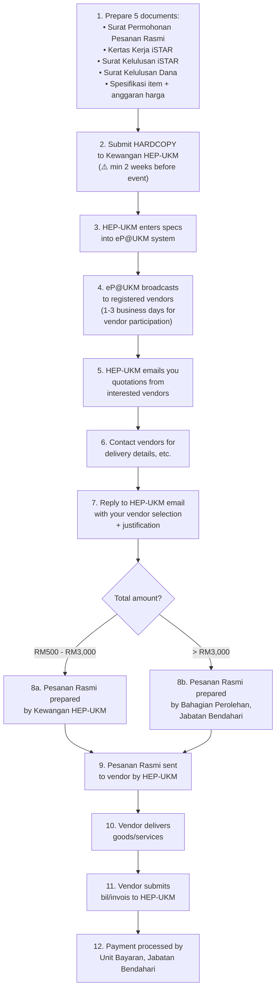

# Pesanan Rasmi (Official Purchase Order via eP@UKM)

Pesanan Rasmi is required for **any purchase of goods or services ≥ RM500**. This includes jamuan, merchandise, printing with UKM logo, accommodation packages, and more.

---

## A-to-Z Flow: Pesanan Rasmi

## Critical Things to Know

### You DON'T handle the eP@UKM broadcast
The broadcast to registered vendors is done **entirely by HEP-UKM**, not by you. This is why the 2-week lead time exists — steps 3-5 take time and are outside your control.

### UKM Logo = Licensed Vendors Only
If your purchase involves **any printing of the UKM logo** (t-shirts, banners, certificates, etc.), you MUST use a Pembekal Berlesen Cop Dagangan UKM. Check the list at: https://www.ukm.my/inovasi-ukm/ → Our Services → UKM Trademark Registration.

### Vendor Must Be eP@UKM Registered
Pesanan Rasmi can only go to vendors registered in the eP@UKM system (https://ukmperolehan.ukm.my/). If your preferred vendor isn't registered, they need to register first — factor this into your timeline.

### When in Doubt, Ask HEP-UKM First
The Buku Panduan KMUKM explicitly says: "Pemohon disarankan untuk mendapatkan nasihat daripada Kewangan HEP-UKM sama ada sesuatu barangan/perkhidmatan memerlukan Pesanan Rasmi ataupun tidak."

---

## Timeline Planning

| Step | Duration | Notes |
|------|----------|-------|
| Prepare documents | 2-3 days | Get all signatures |
| Submit to HEP-UKM | — | Must be ≥ 2 weeks before event |
| eP@UKM broadcast | 1-3 business days | Depends on vendor response |
| Vendor selection | 1-2 days | You choose + justify |
| Pesanan Rasmi preparation | 2-3 days | Longer if > RM3,000 (goes to Jabatan Bendahari) |
| Vendor delivery | Varies | Coordinate directly |
| **Total minimum** | **~2 weeks** | Plan for 3 weeks if possible |
