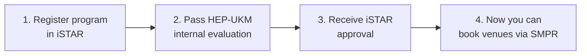

# 05 — Venue & Logistics (Tempat dan Logistik)

Booking a venue at UKM involves more steps than just finding a room. Programs must be registered in iSTAR and approved before any booking can happen.

---

## Venue Booking Prerequisites

> ⚠️ **You cannot book a venue until your program is registered and approved in iSTAR.** The SMPR system requires your event to exist in the system.

---

## SMPR — Sistem Maklumat Pengurusan Ruang

**URL:** https://ewarga.ukm.my/smpr/index.cfm

SMPR is UKM's central room booking system. All venue bookings go through here.

### How to Use SMPR

1. Log in at https://ewarga.ukm.my/smpr/index.cfm with your UKM credentials
2. Select venue category: Pembelajaran, Dewan Peperiksaan, Mesyuarat, Ruang Khas/Serbaguna, or search via Carian Aktiviti
3. Search by activity keyword (minimum 3 characters) or use `*` to browse all
4. Select available dates and submit booking

### Venue Categories in SMPR

- **Pembelajaran** — Teaching rooms / lecture halls
- **Dewan Peperiksaan** — Exam halls
- **Mesyuarat** — Meeting rooms
- **Ruang Khas/Serbaguna** — Special/multipurpose halls (e.g., AST)
- **Carian Aktiviti** — Search by event name

---

## Available Venue Types

| Venue | Best For | Guide |
|-------|----------|-------|
| **AST (Aras Serbaguna Tunku)** | Large events, hackathons, conferences | [`ast/`](ast/) |
| **Kolej Kediaman** | Overnight programs, camps, residential events | [`kolej-kediaman/`](kolej-kediaman/) |
| **Faculty rooms** | Workshops, meetings, small programs | Book via SMPR or faculty HEP |
| **Dewan / Auditorium** | Ceremonies, large gatherings | Book via SMPR |

---

## Equipment Booking

For equipment and event facilities (PA system, tables, chairs, staging, etc.), use the **Borang Permohonan Peralatan Dan Kemudahan Majlis** included in this folder.

## Files in This Folder

| File | Description |
|------|-------------|
| `borang-peralatan-kemudahan-majlis.pdf` | Equipment & event facilities request form |
