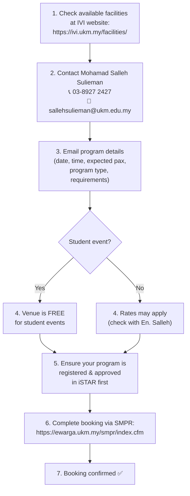

# AST (Aras Serbaguna Tunku) — Venue Booking Guide

AST is one of UKM's premier multipurpose venues, managed under IVI (Institut Visual Informatik). **Student events can get AST venues for free** — but the process requires advance coordination.

---

## A-to-Z Flow: Booking AST

## Key Contacts

| Person | Role | Phone | Email |
|--------|------|-------|-------|
| Mohamad Salleh Sulieman | AST Facility Coordinator | 03-8927 2427 | sallehsulieman@ukm.edu.my |

## Important Notes

- **iSTAR first, booking second:** Your program must be registered and have passed HEP-UKM's internal evaluation before the SMPR booking can be finalized.
- **Book early:** AST is a popular venue. Contact En. Salleh as early as possible, ideally 4-6 weeks before your event.
- **Equipment:** AST may have basic AV equipment available. Ask during your initial email what's included vs. what you need to arrange separately (use [`borang-peralatan-kemudahan-majlis.pdf`](../borang-peralatan-kemudahan-majlis.pdf) for additional equipment requests).
