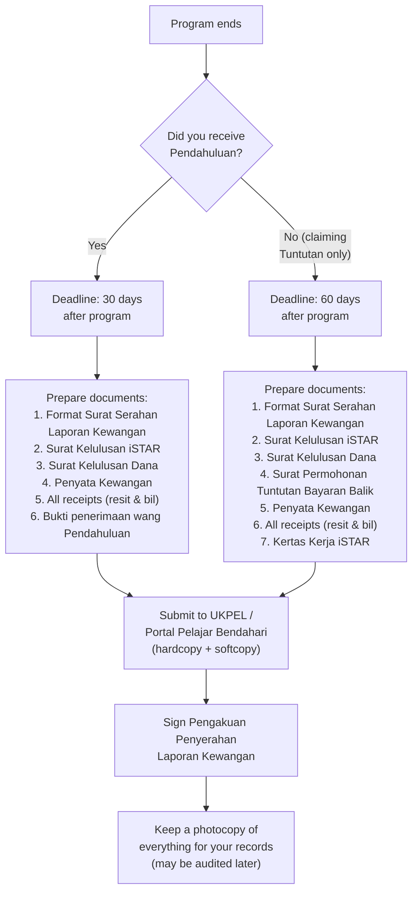

# 06 — Financial Reporting (Laporan Kewangan)

After your program ends, you MUST submit a Laporan Kewangan. Failure to do so will block future Pendahuluan applications and may result in disciplinary action.

---

## Two Types of Laporan Kewangan

| Type | When to Use | Deadline |
|------|-------------|----------|
| **Laporan Kewangan (Pendahuluan)** | You received advance cash (Pendahuluan) | **30 days** after program ends |
| **Laporan Kewangan (Tuntutan)** | You're claiming reimbursement post-program | **60 days** after program ends |

> If you received Pendahuluan AND also want to claim additional Tuntutan, you must submit a combined report containing documents from **both** categories.

---

## A-to-Z Flow: Submitting Laporan Kewangan

## Common Rejection Reasons

1. **Receipts dated after program period** — All resit must be dated before or during the program.
2. **Missing original receipts** — Photocopies are NOT accepted. Hardcopy originals required.
3. **Incomplete documents** — Missing any one of the required documents = automatic rejection.
4. **Receipts for Pesanan Rasmi items claimed via Pendahuluan** — Items ≥ RM500 that should have gone through Pesanan Rasmi cannot be claimed via Laporan Kewangan.
5. **Duplicate claims** — Same receipt used in multiple reports.
6. **Late submission** — After the 30/60-day deadline.

## Consequences of Non-Submission

The Pengakuan Penyerahan form explicitly states these penalties for violations:
- **Tindakan tatatertib** (disciplinary action)
- **Repayment** of the full Pendahuluan amount
- **Rejection** of future Pendahuluan, Tuntutan, and Dana applications
- **Demerit points**

## Files in This Folder

| File | Description |
|------|-------------|
| `format-surat-serahan.pdf` | Format Surat Serahan Laporan Kewangan (cover letter template) |
| `pengakuan-penyerahan.pdf` | Pengakuan Penyerahan Laporan Kewangan (acknowledgment/declaration form) |
| `contoh-laporan-ffh.pdf` | Example: Laporan Kewangan for FFH program |
| `contoh-laporan-kongsi-rezeki.pdf` | Example: Laporan Kewangan for Kongsi Rezeki program |

## Where to Download Forms

Format Surat Serahan Laporan Kewangan can be downloaded from the iSTAR system in PDF format.
