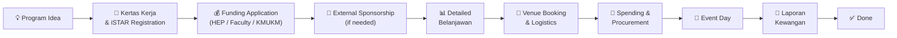
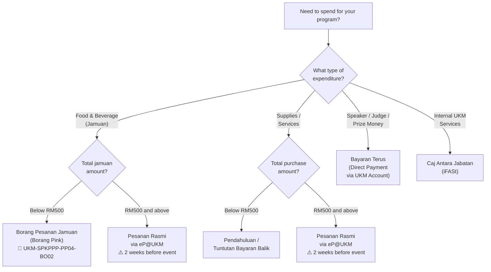

# 📋 UKM Student Event Management & Financial Guide

A one-stop reference for any student organization at Universiti Kebangsaan Malaysia (UKM) to manage the **full lifecycle of running a program** — from initial idea to final Laporan Kewangan submission.

> **Who is this for?** Bendahari, Setiausaha, Ketua Program, and AJK of any kelab, persatuan, or kolej kediaman under UKM.

---

## Program Lifecycle (A → Z)

---

## Repository Structure

| Folder | What's Inside | Start Here If... |
|--------|---------------|------------------|
| [`01-garis-panduan/`](01-garis-panduan/) | Official UKM pekeliling, policies, circulars | You're a new bendahari and need the rules |
| [`02-sumber-dana/`](02-sumber-dana/) | Funding sources: HEP, Faculty, KMUKM, Sponsorship | You need to figure out where the money comes from |
| [`03-belanjawan/`](03-belanjawan/) | Budget templates & worked examples | You're preparing a kertas kerja |
| [`04-perbelanjaan/`](04-perbelanjaan/) | **The key guide** — all spending methods A-to-Z | You need to spend program money |
| [`05-tempat-dan-logistik/`](05-tempat-dan-logistik/) | Venue booking (AST, kolej), equipment, SMPR | You need to book a venue |
| [`06-laporan-kewangan/`](06-laporan-kewangan/) | Report formats, examples, submission forms | Your event is done and you need to submit financials |
| [`07-latihan/`](07-latihan/) | Training modules & slide decks | You want to train new AJK |
| [`panduan-pantas/`](panduan-pantas/) | Bendahari checklist, program timeline, glossary | You need a quick reference |
| [`scripts/`](scripts/) | Automation scripts for repo maintenance | You're maintaining this repo |

---

## Quick Decision Tree: How Should I Spend?

---

## Key Documents

| Document | What It Covers |
|----------|---------------|
| Pekeliling Bendahari Bil. 8/2022 | Jamuan rates, hotel packages, guest hospitality rates |
| Pindaan Bil. 4/2025 | Updated jamuan eligibility (programs < 6 hours crossing 12:30pm now qualify) |
| Garis Panduan Pengurusan Kewangan Kegiatan Pelajar | Master financial procedures guide (HEP FTSM) |
| Buku Panduan Lengkap Dana KMUKM | Complete KMUKM funding guide A-to-Z |

---

## How to Use This Repo

1. **Identify your phase** in the program lifecycle above.
2. **Open the relevant folder** — every folder has its own `README.md` with step-by-step guides and flowcharts.
3. **Download forms** directly from the folder.
4. **Check `panduan-pantas/`** for quick checklists and timelines.

---

## Maintenance

This repo is designed to be autonomously updated. See [`CONTRIBUTING.md`](CONTRIBUTING.md) for maintenance guidelines and [`scripts/`](scripts/) for automation tools.

**Last updated:** March 2026

---

## License

Guide content in this repository is licensed under [CC BY-SA 4.0](https://creativecommons.org/licenses/by-sa/4.0/). Official UKM documents (PDF forms, pekeliling) are copyright Universiti Kebangsaan Malaysia and are included for educational reference only.
